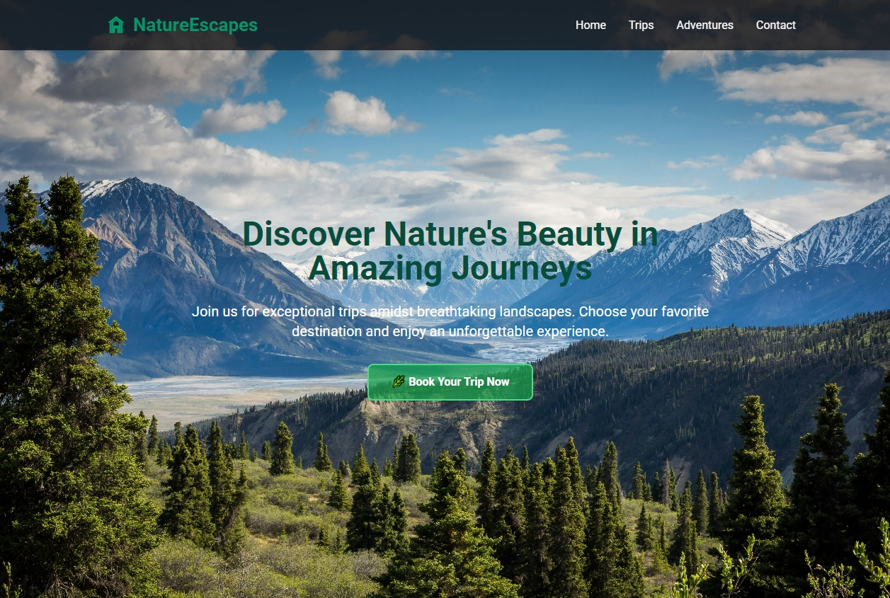

# NatureEscapes - Adventure Travel Website

## 🌿 Overview

NatureEscapes is a modern, responsive website for an adventure travel company that specializes in nature expeditions and mountain climbing experiences. Built with HTML, TailwindCSS, and JavaScript, the site features an immersive user interface with stunning visuals and smooth animations.

## ✨ Features

- **Responsive Design**: Fully responsive layout that works seamlessly across all devices
- **Interactive Elements**: Hover effects and smooth transitions for enhanced user experience
- **Dynamic Navigation**: Collapsible mobile menu for better mobile navigation
- **Contact Form**: Validated contact form with real-time feedback
- **Membership Plans**: Three-tier pricing structure with interactive cards
- **Newsletter Integration**: Email subscription functionality
- **Social Media Integration**: Connected social media links and icons

## 🛠️ Technologies Used

- HTML5
- TailwindCSS
- JavaScript

## 📱 Responsive Design

The website is optimized for:
- Desktop computers
- Tablets
- Mobile phones
- Various screen sizes and orientations

## 🚀 Performance

- Optimized images
- Lazy loading implementation
- Smooth animations
- Fast loading times

## 📄 Pages & Sections

1. Hero Section
2. Featured Adventures
3. Safety Information
4. Mountain Climbing Experiences
5. Membership Plans
6. Contact Form
7. Newsletter Subscription

## 🔧 Setup

1. Clone the repository
2. Open index.html in your browser
3. No build process required - ready to use!

## 📝 License

This project is licensed under the MIT License - see the LICENSE.md file for details

## 🤝 Contributing

Contributions, issues, and feature requests are welcome!

## 📞 Contact

For any questions or feedback, please reach out through the contact form on the website.
